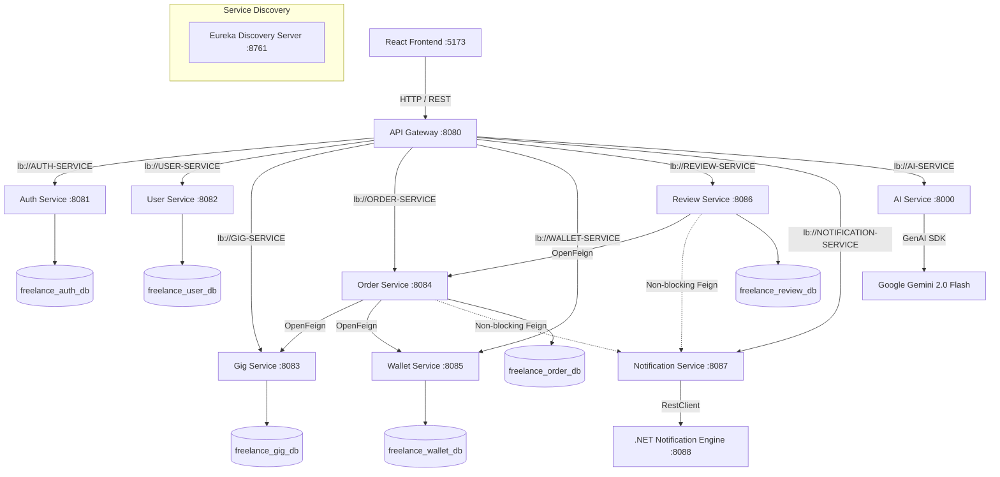

# 🚀 Freelance Marketplace — Polyglot Microservices Platform

[](https://spring.io/projects/spring-boot)
[](https://spring.io/projects/spring-cloud)
[](https://dotnet.microsoft.com/)
[](https://fastapi.tiangolo.com/)
[](https://reactjs.org/)
[](https://www.docker.com/)

An enterprise-grade, polyglot microservices platform enabling freelancers to offer digital services, clients to order gigs and manage secure wallet escrows, and admins to oversee platform operations. Features an AI-powered automated Gig generator built with Python FastAPI and Google Gemini 2.0 Flash.

---

## 👥 Team Members

- **Ronit**
- **Utkarsh**
- **Nimish**
- **Arvind**

---

## 🏗️ Polyglot Microservices Architecture

The system transitions from a monolithic architecture to a **decoupled, polyglot microservices architecture** using a **Database-Per-Service** isolation model.



---

## 💻 Tech Stack & Microservices Matrix

| Service Name | Stack & Language | Port | Database | Primary Responsibility |
| :--- | :--- | :--- | :--- | :--- |
| **API Gateway** | Java 21 / Spring Cloud Gateway | `8080` | *Stateless* | Central entrypoint, JWT authentication, header propagation (`X-User-Id`, `X-User-Role`), CORS management |
| **Auth Service** | Java 21 / Spring Security JWT | `8081` | `freelance_auth_db` | Registration, BCrypt password hashing, credential verification, JWT token minting |
| **User Service** | Java 21 / Spring Data JPA | `8082` | `freelance_user_db` | Freelancer & Client profiles, avatar URLs, bio data, skills & experience |
| **Gig Service** | Java 21 / Spring Data JPA | `8083` | `freelance_gig_db` | Service offerings CRUD, category management, dynamic search & sorting, soft delete |
| **Order Service** | Java 21 / Spring Data JPA | `8084` | `freelance_order_db` | Order placement, price snapshots, status workflows (`PENDING` $\to$ `COMPLETED`), OpenFeign integration |
| **Wallet Service** | Java 21 / Spring Data JPA | `8085` | `freelance_wallet_db` | Financial balance tracking, zero-loss escrow invariant (`Lock`, `Release`, `Refund`), transaction logs |
| **Review Service** | Java 21 / Spring Data JPA | `8086` | `freelance_review_db` | Star ratings (1-5) and feedback enforcement (strictly 1 review per completed order) |
| **Notification Service** | Java 21 / Spring Boot | `8087` | *Adapter* | Spring REST adapter routing notifications from Java services to the .NET engine |
| **Notification Engine** | C# / .NET 8 Web API | `8088` | *In-Memory Store* | High-performance, thread-safe notification engine (`ConcurrentDictionary`) |
| **AI Service** | Python 3.11+ / FastAPI | `8000` | *Stateless* | AI-assisted Gig listing creation powered by Google Gemini 2.0 Flash + smart fallback generator |
| **Discovery Server** | Java 21 / Netflix Eureka | `8761` | *Stateless* | Service discovery registry for dynamic instance resolution (`lb://`) |

---

## Key Features & Architectural Highlights

### 🔒 1. Gateway Security & Identity Propagation
- **Stateless Gateway Authentication**: The API Gateway (`:8080`) intercepts incoming HTTP requests, validates the cryptographic JWT signature, and strips invalid tokens.
- **Identity Header Mutation**: Upon successful JWT validation, the Gateway injects trusted HTTP headers (`X-User-Id`, `X-User-Role`, `X-User-Email`) for downstream microservices. Downstream services do not need to query a database for authentication details.

### 💰 2. Financial Escrow Invariant (Zero-Loss Guarantee)
- **Escrow Accounting Invariant**: `Total Balance = Available Balance + Escrow Balance`.
- **Order Creation (`Lock`)**: Funds are moved from the Client's `Available` balance into `Escrow`. `Total` balance remains constant.
- **Order Completion (`Release`)**: Funds are deducted from the Client's `Escrow` balance and credited to the Freelancer's `Available` balance.
- **Order Cancellation (`Refund`)**: Funds are returned from the Client's `Escrow` balance back to their `Available` balance.

### 🤖 3. GenAI Gig Assistant (FastAPI + Google Gemini)
- Accepts short keywords (e.g. *"react spring boot website"*) and returns a fully formatted, professional marketplace listing.
- **Strict Schema Enforcement**: Uses `google.genai.types.GenerateContentConfig` with `response_schema=GigResponse` to force LLM outputs into structured JSON.
- **Intelligent Fallback Generator**: If API key quotas are exceeded, an internal keyword heuristic parser generates high-quality fallback listings across 5 major service domains.

### 🛡️ 4. Graceful Degradation & Resilient Notifications
- Inter-service notification triggers inside `OrderServiceImpl` and `ReviewServiceImpl` are wrapped in non-fatal `try-catch` blocks.
- If the Notification Service is slow or unreachable, the primary financial transaction (order completion/payment) proceeds without rolling back.

### ⚠️ 5. Centralized Error Handling
- Shared module `common-exception` provides custom exceptions (`BadRequestException`, `ResourceNotFoundException`, `ForbiddenException`, `ConflictException`).
- `@RestControllerAdvice` formats errors into a standard JSON `ErrorResponse` payload across all services.

---

## ⚡ Quick Start & Execution Guide

### Prerequisites
- **Java JDK 21**
- **Node.js 18+** & **npm**
- **Python 3.11+** (for AI Service)
- **MySQL 8.0** running locally on port `3306` with root credentials (`root`/`root`)
- **Maven 3.9+** (or included Maven Wrapper)

---

### Step 1: Build Shared Libraries & Microservices

```bash
cd microservices
mvn clean install -DskipTests
```

---

### Step 2: Start Microservices (Order of Startup)

Start each service in a separate terminal or IDE run configuration:

1. **Discovery Server** (`:8761`):
   ```bash
   cd microservices/discovery-server
   mvn spring-boot:run
   ```

2. **API Gateway** (`:8080`):
   ```bash
   cd microservices/api-gateway
   mvn spring-boot:run
   ```

3. **Domain Microservices**:
   ```bash
   # Terminal 3: Auth Service (:8081)
   cd microservices/auth-service && mvn spring-boot:run

   # Terminal 4: User Service (:8082)
   cd microservices/user-service && mvn spring-boot:run

   # Terminal 5: Gig Service (:8083)
   cd microservices/gig-service && mvn spring-boot:run

   # Terminal 6: Order Service (:8084)
   cd microservices/order-service && mvn spring-boot:run

   # Terminal 7: Wallet Service (:8085)
   cd microservices/wallet-service && mvn spring-boot:run

   # Terminal 8: Review Service (:8086)
   cd microservices/review-service && mvn spring-boot:run

   # Terminal 9: Notification Service (:8087)
   cd microservices/notification-service && mvn spring-boot:run
   ```

4. **Notification Engine (.NET 8)** (`:8088`):
   ```bash
   cd microservices/notification-api
   dotnet run
   ```

5. **AI Service (Python FastAPI)** (`:8000`):
   ```bash
   cd microservices/ai-service
   pip install -r requirements.txt
   uvicorn main:app --port 8000 --reload
   ```

---

### Step 3: Start the React Frontend (`:5173`)

```bash
cd frontend
npm install
npm run dev
```

Open your browser at `http://localhost:5173`.

---

## 🐳 Docker Deployment (Alternative)

To run the entire microservices ecosystem using Docker Compose:

```bash
cd microservices
docker-compose up --build
```

---

## 📡 API Endpoints Overview

All request traffic is routed through the **API Gateway at `http://localhost:8080`**:

| Method | Endpoint | Access | Description |
| :--- | :--- | :--- | :--- |
| `POST` | `/auth/register` | Public | Register new `ROLE_CLIENT` or `ROLE_FREELANCER` account |
| `POST` | `/auth/login` | Public | Authenticate user and receive 24h JWT token |
| `GET` | `/auth/me` | Protected | Fetch currently authenticated user credentials |
| `GET` | `/gigs` | Public | Search and filter gigs with dynamic sorting |
| `POST` | `/gigs` | Freelancer | Create a new gig listing |
| `POST` | `/orders` | Client | Place an order and lock funds into escrow |
| `PATCH` | `/orders/{id}/status` | Freelancer | Accept, start, or complete an order |
| `GET` | `/wallet` | Protected | Fetch current available, escrow, and total balance |
| `POST` | `/wallet/deposit` | Protected | Add funds to wallet balance |
| `POST` | `/reviews` | Client | Submit a rating and review for a completed order |
| `POST` | `/api/v1/ai/generate` | Protected | Generate structured Gig listing using AI |
| `GET` | `/notifications` | Protected | Retrieve notifications for logged-in user |

---

## 📜 License

This project is created for educational, demonstration, and interview preparation purposes. All rights reserved by the project team.
