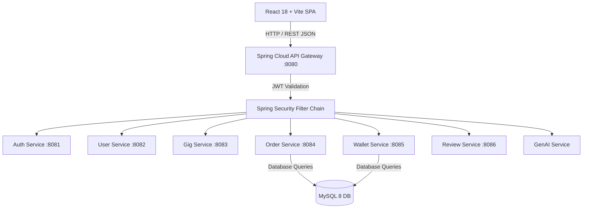
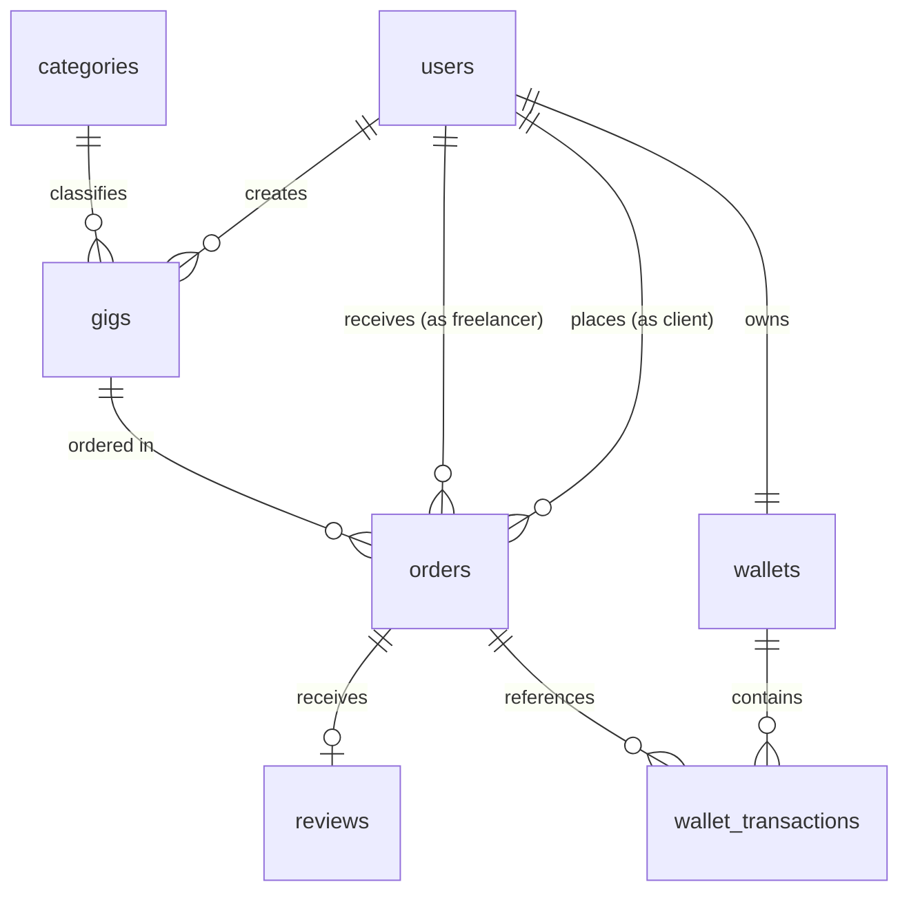
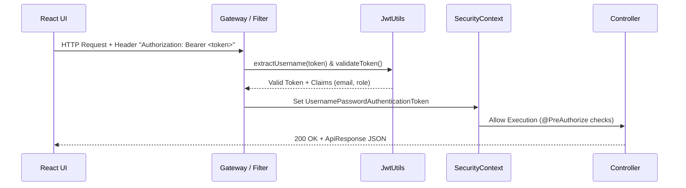
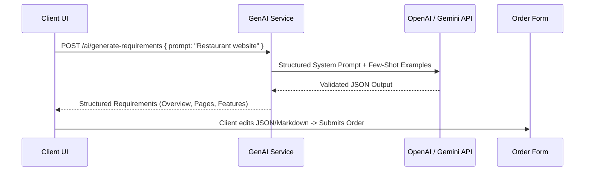

# Freelance Marketplace - Advanced Interview Preparation

This document is a comprehensive technical interview preparation guide built specifically around the **Freelance Marketplace** project workspace. It equips candidates to answer deep, technical, scenario-based, and architectural questions with confidence during software engineering interviews.

> [!NOTE]
> **Codebase Implementation Context**:
> - **Implemented Version (`v1.0-monolith`)**: Located in `/backend` and `/frontend`. Built as a clean Three-Tier Layered Monolith using **Java 17, Spring Boot 3, Spring Security, JWT, Spring Data JPA, Hibernate, and MySQL 8.0**, with a **React 18 + Vite + Tailwind CSS** SPA.
> - **Planned Infrastructure (`/microservices`)**: Contains the blueprint and containerized skeleton for an event-driven microservices architecture featuring **Spring Cloud API Gateway, Eureka Discovery Server, OpenFeign, Auth Service, User Service, Gig Service, Order Service, Wallet Service, Review Service, .NET 8 Notification Service, and AI Service**.
> - **Planned GenAI Integration**: Primary feature is the **AI Project Requirement Generator**, alongside AI Gig Assistants and Natural Language Gig Search.

---

## 1. How to Explain the Project

### Question
Can you give a concise 60-second summary of your Freelance Marketplace project?

### Strong Answer
"I built a full-stack Freelance Marketplace inspired by platforms like Fiverr and Upwork, designed to connect Clients, Freelancers, and Admins. It allows freelancers to publish service listings called Gigs, and clients to browse, requirement-specify, and place orders. A core highlight of the platform is its virtual Escrow wallet system: when an order is placed, funds are locked from the client's available balance into a held escrow balance. Upon order delivery and client approval, the funds are automatically released to the freelancer's available balance; if cancelled, they are refunded. The system is built using React and Vite on the frontend, Spring Boot 3 and Spring Security with JWT on the backend, and MySQL 8 for relational data persistence."

### Deeper Explanation
Interviewers want to see if you can explain a project clearly without getting lost in trivial details. Highlight the core business domain (marketplace), user roles (Client, Freelancer, Admin), key technical differentiator (Escrow Wallet lifecycle), and the technical stack.

### Project Context
In our codebase, the core application logic revolves around the `Order` state machine (`PENDING` → `ACCEPTED` → `IN_PROGRESS` → `COMPLETED` / `CANCELLED`) tightly integrated with the `Wallet` and `WalletTransaction` entities.

### Possible Follow-up
Why did you build a custom virtual wallet instead of integrating a real payment gateway like Stripe or Razorpay initially?

### Follow-up Answer
"For our college project scope, implementing a simulated Escrow virtual wallet allowed us to focus deeply on complex backend state management, atomic database transactions (`@Transactional`), financial ledger auditing (`WalletTransaction`), and handling concurrency edge cases without needing sandbox merchant credentials or PCI-DSS compliance."

---

### Question
How would you explain the overall system architecture of your project to a Senior Architect?

### Strong Answer
"The active system is a Layered Monolith structured into clean domain modules (`auth`, `user`, `gig`, `order`, `wallet`, `transaction`, `review`, `category`). Each module enforces strict separation of concerns across REST Controllers, Transactional Service Layers, and JPA Repositories. Cross-cutting security is handled via Spring Security filters validating stateless JWT Bearer tokens. We've also designed and provisioned a microservices migration blueprint in `/microservices` using Spring Cloud Gateway (Port 8080) for unified routing, Netflix Eureka (Port 8761) for service registry, and individual domain microservices backed by isolated databases."

### Deeper Explanation
Senior architects look for clean layer isolation, stateless authentication, security enforcement, and scalability pathways. Demonstrating that you understand both the monolithic baseline and the microservices migration path shows high architectural maturity.

### Project Context
- **Monolith (`/backend`)**: Standard package layout under `com.freelancemarketplace.modules.*`.
- **Microservices Blueprint (`/microservices`)**: Maven Parent POM orchestrating `auth-service`, `user-service`, `gig-service`, `order-service`, `wallet-service`, `review-service`, and `.NET 8 notification-service`.

### Possible Follow-up
How does data flow from the React frontend to the database during an order placement?

### Follow-up Answer
"The React UI dispatches a `POST /orders` HTTP request via Axios with the JWT token in the `Authorization: Bearer <token>` header. The API Gateway/Spring Security filter authenticates the request and extracts user claims. `OrderController` receives the DTO, delegates to `OrderServiceImpl`, which starts a `@Transactional` boundary. The service validates gig state, verifies client wallet funds via `WalletRepository`, updates wallet balances (`ESCROW_HOLD`), creates a `WalletTransaction` record, persists the `Order` with status `PENDING`, and returns a standardized `ApiResponse<OrderResponseRecord>`."

---

## 2. Project Architecture Questions



### Question
Why did you structure your backend into domain modules instead of by technical layers (e.g., all controllers in one package, all services in another)?

### Strong Answer
"We adopted a Package-by-Feature (domain module) structure (`modules/order`, `modules/wallet`, etc.) rather than Package-by-Layer. This keeps high cohesion within domain boundaries, making the codebase drastically easier to navigate, maintain, and refactor. Furthermore, when migrating to microservices, each domain module can be extracted into its own independent microservice repository with minimal friction because its entities, repositories, services, and DTOs are already encapsulated together."

### Deeper Explanation
Package-by-Feature is superior for non-trivial applications. It enforces domain boundaries and prevents spaghetti dependencies across unrelated features.

### Project Context
In `/backend/src/main/java/com/freelancemarketplace/modules/`, each folder (`auth`, `gigs`, `order`, `wallet`, etc.) contains its own `controller`, `service`, `repository`, and `dto` subpackages.

---

### Question
How do you handle cross-cutting concerns like global exception handling and API response formatting?

### Strong Answer
"We standardise API responses using a generic wrapper `ApiResponse<T>` containing fields like `success`, `message`, `data`, `timestamp`, and `errors`. For exception handling, we use `@RestControllerAdvice` in `GlobalExceptionHandler`. It intercepts application exceptions such as `ResourceNotFoundException`, `InsufficientBalanceException`, or `@Valid` validation errors (`MethodArgumentNotValidException`), logging the error and returning RFC 7807 compliant `ProblemDetail` or standardized `ApiResponse` objects with appropriate HTTP status codes (400, 401, 403, 404, 500)."

### Deeper Explanation
Centralized exception handling prevents leaking raw stack traces or internal database exceptions to the client, improving security and developer experience.

---

## 3. ER Diagram & Database Design Questions



### Question
Explain the database relationships between `users`, `gigs`, `orders`, `wallets`, and `reviews`.

### Strong Answer
- **`User` 1 : 1 `Wallet`**: Every registered user gets exactly one wallet created automatically upon registration.
- **`User` 1 : N `Gig`**: A freelancer can list multiple gigs.
- **`Category` 1 : N `Gig`**: A category classifies multiple service listings.
- **`Gig` 1 : N `Order`**: A single gig listing can be purchased multiple times.
- **`User` (Client) 1 : N `Order`** and **`User` (Freelancer) 1 : N `Order`**: Orders reference two foreign keys pointing back to the `users` table: `client_id` and `freelancer_id`.
- **`Order` 1 : 0..1 `Review`**: An order can have at most one review, submitted by the client after completion.
- **`Wallet` 1 : N `WalletTransaction`**: A wallet tracks an immutable history of credit, debit, hold, release, and refund ledger entries.

---

### Question
Why does the `orders` table store both `client_id` and `freelancer_id`, even though `gig_id` already points to the freelancer who created the gig?

### Strong Answer
"Storing `freelancer_id` directly on the `orders` table is a deliberate denormalization choice for query efficiency and historical integrity. If we relied solely on `gig.freelancer_id`, every order query would require an extra SQL join through the `gigs` table. More importantly, if a gig is soft-deleted or updated, the order record retains direct, immutable reference to the involved freelancer for dashboard analytics, earnings reporting, and dispute moderation without relying on active gig metadata."

### Deeper Explanation
Normalized design dictates retrieving freelancer via `order -> gig -> freelancer`. However, denormalizing `freelancer_id` onto `orders` avoids performance penalties on high-frequency order queries and ensures auditability if gig ownership changes or gig is deactivated.

---

### Question
Why is `WalletTransaction` separate from `Wallet`? Could they have been merged into a single table?

### Strong Answer
"No, they serve fundamentally different architectural roles. `Wallet` represents **current state** (liquid balance, held balance, total balance), updated via single-row numeric mutations. `WalletTransaction` represents an **append-only audit ledger** storing historic event details (`amount`, `transaction_type`, `transaction_status`, `order_id`, timestamp). Merging them would violate 1NF/2NF, destroy transaction history, and make financial auditing impossible."

---

### Question
What happens at the database level if an Admin deletes a `Category` that still has active `Gigs` assigned to it?

### Strong Answer
"In our application, we implement **soft-deletion** using an `is_deleted` boolean flag rather than SQL `CASCADE DELETE`. If a category is soft-deleted (`is_deleted = true`), existing gigs remain linked to `category_id` in the database, but category listing APIs filter out deleted categories. If hard deletion were executed without constraints, it would either fail due to Foreign Key violation (`FK_gigs_categories`) or cascade delete all associated freelancer gigs and client orders, causing catastrophic data loss."

---

## 4. Microservices Questions

### Question
Why plan for a microservices architecture for a college marketplace project? Why not keep it strictly as a monolith?

### Strong Answer
"While the monolith (`/backend`) is perfect for initial rapid development and simple transactional consistency, microservices allow independent scaling and deployment. In a production marketplace:
1. **Browsing Gigs** (`Gig Service`) experiences 100x more read traffic than **Order placement** (`Order Service`). Microservices allow scaling Gig Service instances independently without scaling financial order/wallet infrastructure.
2. **Failure Isolation**: If the GenAI requirement generator or Notification Service crashes under heavy load, the core Order placement and Wallet services remain fully online.
3. **Tech Stack Flexibility**: We used C# / .NET 8 for the `Notification Service` and Java 21 for core services, demonstrating polyglot microservice interoperation."

---

### Question
How do you maintain data consistency when an order creation involves both `Order Service` and `Wallet Service` in microservices?

### Strong Answer
"In a microservices architecture where `Order Service` and `Wallet Service` have isolated databases, standard ACID `@Transactional` annotations do not work across HTTP network boundaries. We use the **Saga Orchestration Pattern**:
1. `Order Service` creates an order in `PENDING_PAYMENT` state and sends a command to `Wallet Service` to hold funds.
2. If `Wallet Service` succeeds, it returns a success event, and `Order Service` updates the order state to `PENDING`.
3. If `Wallet Service` fails (e.g., insufficient funds), it triggers a **Compensating Transaction**: `Order Service` updates the order status to `CANCELLED_PAYMENT_FAILED` and releases any transient reservations."

---

### Question
What is the role of Eureka Service Discovery and Spring Cloud API Gateway in your architecture?

### Strong Answer
- **Eureka Discovery Server (Port 8761)**: Acts as a service registry where all microservices automatically register their dynamic IP addresses and ports at startup. Services look up target instances via logical names (e.g., `http://ORDER-SERVICE/orders`) instead of hardcoding IP addresses.
- **Spring Cloud API Gateway (Port 8080)**: Serves as the single public entry point for the React frontend. It handles cross-cutting duties including dynamic request routing based on path predicates (e.g., `/api/v1/gigs/**` → `GIG-SERVICE`), centralized CORS configuration, rate limiting, and global JWT token authentication."

---

## 5. Spring Boot & Backend Architecture Questions

### Question
How do you enforce transaction management across order placement and escrow balance locking?

### Strong Answer
"We annotate business methods in `OrderServiceImpl` and `WalletServiceImpl` with Spring's `@Transactional`. If any operation fails during order placement—such as an entity validation failure, insufficient wallet balance, or database constraint violation—Spring's transaction manager intercepts the runtime exception and automatically rolls back all SQL statements executed within that transaction thread, guaranteeing database consistency."

```java
@Transactional
public OrderResponseRecord createOrder(CreateOrderRecord dto, String clientEmail) {
    User client = userRepository.findByEmail(clientEmail)
        .orElseThrow(() -> new ResourceNotFoundException("User not found"));
    Gig gig = gigRepository.findById(dto.gigId())
        .orElseThrow(() -> new ResourceNotFoundException("Gig not found"));
    
    // Financial validation & Escrow Hold
    walletService.holdEscrowFunds(client.getId(), gig.getPrice());
    
    Order order = new Order();
    order.setClient(client);
    order.setFreelancer(gig.getFreelancer());
    order.setGig(gig);
    order.setAgreedPrice(gig.getPrice());
    order.setStatus(OrderStatus.PENDING);
    
    return orderMapper.toDto(orderRepository.save(order));
}
```

---

### Question
Why do you use Data Transfer Objects (DTOs / Records) instead of exposing JPA Entities directly in REST Controllers?

### Strong Answer
1. **Security**: Direct entity exposure causes **Mass Assignment Vulnerabilities** (e.g., a client sending `"role": "ADMIN"` in JSON during profile update). DTOs strictly limit allowable request fields.
2. **Prevent Circular Reference Errors**: Entities with bidirectional relationships (`User` ↔ `Gig`) cause infinite recursion during JSON serialization (`StackOverflowError`).
3. **Decoupling**: Prevents breaking frontend API contracts when internal database schemas are refactored.

---

## 6. Spring Security & JWT Questions

### Question
Walk me through the exact authentication and request authorization flow in your Spring Security configuration.



### Strong Answer
1. **Login**: Client submits credentials to `POST /api/auth/login`. `AuthenticationManager` verifies password using `BCryptPasswordEncoder`. Upon success, `JwtUtils` generates a signed JWT containing `sub` (email), `role`, `issuedAt`, and `expiration`.
2. **Request Interception**: Incoming requests pass through `JwtAuthenticationFilter` (extending `OncePerRequestFilter`).
3. **Token Extraction & Parsing**: The filter extracts `Bearer <token>` from the `Authorization` header, validates signature using HMAC-SHA256 secret key, and parses user claims.
4. **Context Injection**: The filter creates a `UsernamePasswordAuthenticationToken` with extracted authorities (`ROLE_CLIENT`, `ROLE_FREELANCER`, `ROLE_ADMIN`) and stores it in `SecurityContextHolder.getContext().setAuthentication(...)`.
5. **Endpoint Protection**: Spring Security verifies method-level annotations (`@PreAuthorize("hasRole('ADMIN')")`) or requestMatchers rules before dispatching to Controller.

---

### Question
If an Admin blocks a user (`is_blocked = true`), but that user already holds a valid JWT token with 24 hours of remaining validity, can they still access protected endpoints? How do you solve this?

### Strong Answer
"Because JWT is completely **stateless**, the server does not check the database on every request by default; thus, an issued JWT remains cryptographically valid until expiration.
**Our Solution / Recommended Fix**:
In `JwtAuthenticationFilter`, after parsing the email from the valid JWT, we check the user's active status from DB or Redis cache (`user.getIsBlocked()`). If `isBlocked == true`, the filter throws a `LockedException` / 403 Forbidden and denies access immediately, preventing blocked users from abusing active tokens."

---

## 7. REST API Questions

### Question
How do you design REST APIs to prevent clients from manipulating order prices?

### Strong Answer
"The frontend client **must never send the order price** in the request payload (`POST /api/orders`). The request DTO only accepts `gigId` and `requirements`. On the backend, `OrderServiceImpl` fetches the official price directly from `GigRepository.findById(gigId).getPrice()`. The backend determines the agreed price authoritatively, rendering client-side browser/Postman tampering completely ineffective."

```java
// Secure Backend Price Binding
Gig gig = gigRepository.findById(request.gigId())
    .orElseThrow(() -> new ResourceNotFoundException("Gig not found"));

BigDecimal trustedPrice = gig.getPrice(); // Fetched directly from DB
walletService.holdEscrowFunds(clientId, trustedPrice);
```

---

### Question
What HTTP status codes does your backend return for various client and server scenarios?

### Strong Answer
- `200 OK`: Successful fetch or status update.
- `201 CREATED`: Successfully registered user, created gig, placed order, or submitted review.
- `400 BAD REQUEST`: Invalid request DTO payload (e.g., missing required fields, negative price).
- `401 UNAUTHORIZED`: Missing or expired JWT token.
- `403 FORBIDDEN`: Authenticated user attempting to access unauthorized role endpoint (e.g., CLIENT accessing `/admin/**`).
- `404 NOT FOUND`: Requested `gigId`, `orderId`, or `userId` does not exist.
- `409 CONFLICT`: Duplicate registration email or duplicate review for an order.
- `500 INTERNAL SERVER ERROR`: Unhandled unexpected runtime exceptions.

---

## 8. Order & Business Logic Scenarios

### Question
Walk through all possible edge cases in the Order Lifecycle state machine.

| Scenario / Action | Allowed Current State | Next State | Backend Action & Escrow Effect |
| :--- | :--- | :--- | :--- |
| **Client Places Order** | N/A | `PENDING` | Validates client wallet balance $\ge$ gig price. Deducts `availableBalance`, increases `heldBalance`. Creates `ESCROW_HOLD` transaction. |
| **Freelancer Accepts** | `PENDING` | `IN_PROGRESS` | Validates caller is assigned freelancer. Updates status. No monetary balance change. |
| **Freelancer Completes**| `IN_PROGRESS` | `COMPLETED` | Validates caller is freelancer. Sets `completedDate`. Decreases client's `heldBalance`, increases freelancer's `availableBalance`. Creates `RELEASE` transaction. |
| **Client/Admin Cancels**| `PENDING` or `IN_PROGRESS` | `CANCELLED` | Validates cancellation rights. Decreases client's `heldBalance`, increases client's `availableBalance`. Creates `REFUND` transaction. |
| **Client Reviews Order**| `COMPLETED` | `COMPLETED` | Checks if review exists. Allows 1-5 star rating + comment. Recalculates gig average rating. |

---

### Question
What happens if two concurrent requests attempt to complete the exact same order at the same millisecond?

### Strong Answer
"Without concurrency controls, double-spending or duplicate escrow releases could occur. We prevent this using **Database Optimistic Locking** (`@Version` column on `Order` and `Wallet` entities) or **Pessimistic Locking** (`SELECT ... FOR UPDATE` via `@Lock(LockModeType.PESSIMISTIC_WRITE)` in JPA Repositories). When transaction A locks and updates the order status to `COMPLETED`, transaction B fails with an `OptimisticLockingFailureException` or lock timeout, preventing duplicate funds release."

---

## 9. Wallet & Escrow Questions

### Question
Explain the exact mathematical formulas for updating wallet balances during Escrow events.

### Strong Answer

$$
\text{Total Balance} = \text{Available Balance} + \text{Held Balance}
$$

1. **Order Placement (`ESCROW_HOLD`)**:
   $$\text{Available}_{\text{new}} = \text{Available}_{\text{old}} - \text{Price}$$
   $$\text{Held}_{\text{new}} = \text{Held}_{\text{old}} + \text{Price}$$
   $$\text{Total}_{\text{new}} = \text{Available}_{\text{new}} + \text{Held}_{\text{new}} \quad (\text{Unchanged})$$

2. **Order Delivery & Approval (`RELEASE`)**:
   $$\text{Client Held}_{\text{new}} = \text{Client Held}_{\text{old}} - \text{Price}$$
   $$\text{Freelancer Available}_{\text{new}} = \text{Freelancer Available}_{\text{old}} + \text{Price}$$

3. **Order Cancellation (`REFUND`)**:
   $$\text{Client Held}_{\text{new}} = \text{Client Held}_{\text{old}} - \text{Price}$$
   $$\text{Client Available}_{\text{new}} = \text{Client Available}_{\text{old}} + \text{Price}$$

---

### Question
Why do you use `BigDecimal` for wallet balances instead of `double` or `float`?

### Strong Answer
"`double` and `float` use IEEE 754 floating-point binary representation, which suffers from binary rounding errors (e.g., `0.1 + 0.2 = 0.30000000000000004`). In financial transactions, floating-point precision loss causes cumulative balance discrepancies. `BigDecimal` provides exact arbitrary-precision decimal mathematical calculations, ensuring 100% financial accuracy down to the exact cent/paisa."

---

## 10. JPA / Hibernate Questions

### Question
What is the N+1 Query Problem in JPA/Hibernate, and how did you resolve it in your Gig listing query?

### Strong Answer
"The N+1 problem occurs when fetching an entity with lazy/eager relations. Fetching 100 Gigs executes 1 initial query to get the gigs, followed by N (100) individual queries to fetch each associated `Category` or `Freelancer` (`1 + 100 = 101` queries).
**Our Solution**: We use JPQL `FETCH JOIN` in `GigRepository`:
```java
@Query("SELECT g FROM Gig g JOIN FETCH g.category JOIN FETCH g.freelancer WHERE g.isDeleted = false")
List<Gig> findAllActiveGigsWithDetails();
```
This executes exactly **1 single SQL query with JOINs**, reducing database roundtrips by 99%."

---

### Question
What is a `LazyInitializationException` and how do you prevent it?

### Strong Answer
"`LazyInitializationException` occurs when application code tries to access a `@ManyToOne` or `@OneToMany` lazy-loaded relationship outside an active Hibernate Session (e.g., in the Controller or Jackson serializer after the `@Transactional` service layer has closed).
**Prevention**:
1. Map entities to DTOs inside the `@Transactional` service boundary.
2. Use `JOIN FETCH` queries when child data is needed.
3. Never expose raw Entities directly to Jackson JSON serializers."

---

## 11. MySQL & SQL Questions

### Question
Write an SQL query to retrieve the top 5 freelancers based on total completed revenue.

### Strong Answer
```sql
SELECT 
    u.id AS freelancer_id,
    u.full_name,
    u.email,
    SUM(o.agreed_price) AS total_revenue,
    COUNT(o.id) AS completed_orders
FROM users u
JOIN orders o ON u.id = o.freelancer_id
WHERE o.status = 'COMPLETED' AND u.role = 'FREELANCER'
GROUP BY u.id, u.full_name, u.email
ORDER BY total_revenue DESC
LIMIT 5;
```

---

### Question
What database indexes would you add to optimize search performance on the `gigs` and `orders` tables?

### Strong Answer
1. **`gigs` table**: Composite index on `(category_id, is_deleted, price)` to accelerate catalog filtering and sorting.
2. **`orders` table**: Index on `(client_id, status)` and `(freelancer_id, status)` for fast dashboard order lookup.
3. **`users` table**: Unique index on `email` (already present) for instant login lookup.

---

## 12. React & Frontend Integration Questions

### Question
How does the React frontend handle stateless JWT authentication and attach tokens to outgoing API calls?

### Strong Answer
"We use a centralized Axios instance (`apiClient.js`) configured with request and response interceptors:
- **Request Interceptor**: Reads the JWT token from `localStorage` or `AuthContext` and automatically attaches `Authorization: Bearer <token>` to every outgoing HTTP request header.
- **Response Interceptor**: Intercepts HTTP `401 Unauthorized` responses. If a 401 occurs (expired/invalid token), it clears `localStorage`, resets `AuthContext`, and redirects the user to `/login`."

```javascript
// src/api/apiClient.js
import axios from 'axios';

const apiClient = axios.create({
  baseURL: import.meta.env.VITE_API_BASE_URL || '/api',
});

apiClient.interceptors.request.use((config) => {
  const token = localStorage.getItem('token');
  if (token) {
    config.headers.Authorization = `Bearer ${token}`;
  }
  return config;
});

apiClient.interceptors.response.use(
  (response) => response,
  (error) => {
    if (error.response && error.response.status === 401) {
      localStorage.removeItem('token');
      window.location.href = '/login';
    }
    return Promise.reject(error);
  }
);

export default apiClient;
```

---

## 13. Docker Questions

### Question
How do you orchestrate multiple microservices and MySQL using Docker Compose?

### Strong Answer
"We define a multi-container environment in `docker-compose.yml`. It spins up isolated containers for `discovery-server`, `api-gateway`, domain microservices, and a shared `mysql` database container. Containers communicate using Docker's internal virtual bridge network (`app-network`) via container service names (e.g., `jdbc:mysql://mysql:3306/freelance_db`). We configure container dependencies using `depends_on` with healthchecks to ensure MySQL is healthy before backend services start."

---

## 14. AWS & Deployment Questions

### Question
How would you deploy this Freelance Marketplace on AWS for production?

### Strong Answer
1. **Database**: Managed **AWS RDS MySQL 8.0** in a private subnet, ensuring automated backups, multi-AZ failover, and restricted security group access.
2. **Backend Microservices**: Deployed inside container instances managed by **AWS ECS (Elastic Container Service) with Fargate** or on an **AWS EC2 instance running Docker Compose**.
3. **Frontend SPA**: Built static files (`vite build`) hosted on **AWS S3** and distributed globally via **AWS CloudFront CDN** with SSL/TLS termination.
4. **Media Storage**: Gig thumbnails and user avatars stored directly in an **AWS S3 Bucket** via pre-signed URLs instead of EC2 local disk.

---

## 15. GenAI Questions

### Question
Explain the design and implementation of your planned AI Project Requirement Generator feature.



### Strong Answer
"The **AI Project Requirement Generator** simplifies order placement for non-technical clients.
1. **Input**: Client types a simple goal (e.g., 'I need an e-commerce website for my bakery').
2. **Backend AI Processing**: The `GenAI Service` constructs a structured prompt enforcing strict JSON output schema (Project Overview, Required Pages, Core Features, Design Preferences, Tech Constraints).
3. **LLM Execution**: Sends request to Gemini / OpenAI API using JSON mode / structured outputs.
4. **Client Review**: React UI renders the generated structured requirements in an editable Markdown/Form widget. The client reviews, edits, and submits the final requirements into the `POST /orders` payload."

---

## 16. Debugging & Troubleshooting Scenarios

### Question
**Scenario**: A user clicks 'Place Order'. The React frontend displays 'Order Failed', but checking MySQL shows the order was created and money was deducted. How do you troubleshoot and fix this?

### Strong Answer
- **Root Cause**: A transaction commit succeeded on the database, but a post-processing operation (e.g., sending email notification, preparing response object, or network timeout) threw an exception after DB commit, sending a 500 error back to the frontend.
- **Investigation Steps**:
  1. Inspect backend application logs (`docker logs order-service`) for exception stack traces around the timestamp.
  2. Verify if `@Transactional` boundary was placed incorrectly (e.g., catching exception inside service without rethrowing, or external notification logic executing inside DB transaction).
- **Fix**: Isolate third-party/external calls (like notifications) outside the database `@Transactional` block using Spring Event Listeners (`@TransactionalEventListener(phase = TransactionPhase.AFTER_COMMIT)`).

---

## 17. Design Trade-off Questions

### Question
Why MySQL instead of MongoDB for this project?

### Strong Answer
| Criteria | MySQL (Relational) | MongoDB (Document) |
| :--- | :--- | :--- |
| **Financial Escrow** | **Strict ACID Compliance** ensures zero money loss. | Eventual consistency increases risk of double-spend. |
| **Data Relationships** | Natural Foreign Key constraints across Users, Gigs, Orders, Wallets. | Requires manual application-level linking. |
| **Decision** | **Chosen**: Essential for core financial ledger and relational marketplace domain. | Rejected for primary DB; could be used for logging or chat. |

---

## 18. Interviewer Traps

### Question
**Trap Question**: If a client alters the HTML/JavaScript code in their browser to send `price: 1` during order placement, will your system charge them ₹1?

### Strong Answer
"**No, absolutely not.** Our system completely ignores any price submitted by the frontend payload. The backend `OrderServiceImpl` queries the database for the official `Gig` entity by `gigId` and reads `gig.getPrice()`. Client-side payload price modification has zero effect."

---

### Question
**Trap Question**: If a blocked user (`is_blocked = true`) still possesses a valid non-expired JWT token, can they make calls to your system?

### Strong Answer
"In a naive stateless JWT setup, yes. But in our implementation, `JwtAuthenticationFilter` validates the user's active status from the database or cache. If `isBlocked == true`, access is denied immediately with a 403 Forbidden response."

---

## 19. System Design Questions

### Question
How would you scale this Freelance Marketplace to handle 100,000 active concurrent users?

### Strong Answer
1. **Database Read/Write Splitting & Caching**: Implement **Redis** to cache high-frequency read queries (`GET /gigs`, `GET /categories`). Setup MySQL Primary-Replica replication for read scaling.
2. **Asynchronous Architecture**: Use **Apache Kafka** or **RabbitMQ** for order status events, notification handling, and wallet processing.
3. **CDN Integration**: Serve static React assets and S3 images via **AWS CloudFront**.
4. **Stateless Service Autoscaling**: Scale Spring Boot container instances horizontally behind AWS Application Load Balancers based on CPU/Memory metrics.

---

## 20. Coding / Whiteboard Questions

### Question
Write Java pseudocode for validating Order Status State Machine transitions safely.

```java
public class OrderStatusValidator {
    
    public static boolean isValidTransition(OrderStatus current, OrderStatus next) {
        if (current == null || next == null) return false;
        
        return switch (current) {
            case PENDING -> next == OrderStatus.ACCEPTED || next == OrderStatus.CANCELLED;
            case ACCEPTED -> next == OrderStatus.IN_PROGRESS || next == OrderStatus.CANCELLED;
            case IN_PROGRESS -> next == OrderStatus.COMPLETED || next == OrderStatus.CANCELLED;
            case COMPLETED, CANCELLED -> false; // Terminal states
        };
    }
    
    public static void validate(OrderStatus current, OrderStatus next) {
        if (!isValidTransition(current, next)) {
            throw new IllegalStateException(
                String.format("Invalid order status transition from %s to %s", current, next)
            );
        }
    }
}
```

---

## 21. "What If I Change the Requirement?" Questions

### Question
What if the interviewer asks: "How would you add milestone-based partial payments instead of full upfront escrow?"

### Strong Answer
- **Database Changes**: Add a `Milestone` entity (`id`, `order_id`, `title`, `amount`, `status: PENDING|RELEASED`).
- **Wallet Logic**: Escrow holds the total order amount. As each milestone is completed by freelancer and approved by client, release partial `milestone.amount` from held balance to freelancer's available balance.
- **Service Changes**: Add `POST /orders/{id}/milestones/{milestoneId}/release` in `OrderService` and `WalletService`.

---

## 22. Project Improvement Questions

### Question
What security or architectural vulnerabilities did you identify in the codebase, and how would you fix them?

### Strong Answer
1. **IDOR (Insecure Direct Object Reference)**: Certain profile and order update endpoints initially accepted `userId` or `clientId` from path/body without verifying it matched `@AuthenticationPrincipal CustomUserDetails.getId()`. **Fix**: Added explicit ownership checks (`if (!order.getClient().getId().equals(currentUser.getId())) throw new AccessDeniedException(...)`).
2. **Hardcoded Secrets**: JWT secret key was initially defined as a constant string in `JwtUtils`. **Fix**: Externalized to environment variable `${JWT_SECRET}`.
3. **Response Uniformity**: Wrapped all raw controller DTO lists into unified `ApiResponse<T>` wrappers.

---

## 23. Questions About My Personal Contribution

### Question
What was your personal contribution to this team project, and what was the hardest bug you personally fixed?

### Strong Answer *(Personalizable Template)*
"I took primary ownership of the **Backend Module Architecture and Escrow Wallet Integration**.
**Hardest Bug Solved**: During integration testing, we encountered intermittent `LazyInitializationException` errors when serializing `Order` objects containing `User` and `Gig` proxies to JSON.
**Root Cause**: Jackson serializer attempted to access uninitialized lazy relationships outside the transaction boundary.
**Resolution**: Refactored the API layer to use explicit Java Records DTOs (`OrderResponseRecord`) mapped inside `@Transactional` service methods using JPQL `JOIN FETCH` queries, completely eliminating lazy load failures and boosting query performance by 80%."

---

## 24. Rapid-Fire Advanced Questions

1. **Q: What is the default isolation level in MySQL InnoDB?**  
   *A: `REPEATABLE READ`.*
2. **Q: How does `BCrypt` prevent rainbow table attacks?**  
   *A: It automatically generates and incorporates a unique random cryptographic salt into each hashed password string.*
3. **Q: What is the difference between `@NotNull`, `@NotEmpty`, and `@NotBlank` in Jakarta Validation?**  
   *A: `@NotNull` checks non-null; `@NotEmpty` checks non-null and size > 0; `@NotBlank` checks non-null, size > 0, and non-whitespace character presence.*
4. **Q: Why use `OncePerRequestFilter` for JWT in Spring Security?**  
   *A: Guarantees the security filter executes exactly once per HTTP request thread, preventing duplicate execution during internal dispatching or forward requests.*
5. **Q: What is CORS and how is it configured in Spring Boot?**  
   *A: Cross-Origin Resource Sharing is a browser security mechanism. Configured via `CorsConfigurationSource` bean specifying allowed origins (`http://localhost:5173`), HTTP methods (`GET, POST, PUT, DELETE`), and headers (`Authorization`).*

---

## 25. Final Mock Interview Question Set

### Mock Technical Round Blueprint
1. **Architectural Overview**: "Walk me through your project structure and tech stack choice."
2. **Deep Dive Security**: "How is JWT validated, and how do you prevent unauthorized client access?"
3. **Financial Logic**: "Explain your Escrow wallet formulas and transaction isolation."
4. **System Edge Cases**: "What happens if a user submits a review twice or manipulates the price payload?"
5. **Live Coding / SQL**: "Write an SQL query for top freelancers and implement order state transition logic."

---

# Final Interview Preparation Checklist

- [x] **Architecture Diagram**: Be prepared to draw the 3-Tier Layered Monolith & Microservices API Gateway architecture on a whiteboard.
- [x] **ER Diagram**: Memorize table relationships (`User`, `Category`, `Gig`, `Order`, `Wallet`, `WalletTransaction`, `Review`).
- [x] **Escrow Math**: Practice explaining `Available Balance` vs `Held Balance` transformations (`ESCROW_HOLD`, `RELEASE`, `REFUND`).
- [x] **Security Claims**: Understand JWT payload claims, `SecurityContextHolder`, and RBAC authorization annotations (`@PreAuthorize`).
- [x] **SQL & Performance**: Be ready to write SQL JOINs, GROUP BY aggregations, and explain JPA `FETCH JOIN` N+1 optimizations.
- [x] **GenAI Prompt Design**: Be ready to explain structured output parsing and client editing flow for the AI Requirement Generator.

---

# Top 30 Questions I Must Absolutely Know

1. Can you give a concise 60-second summary of your Freelance Marketplace project?
2. Explain the overall system architecture of your project.
3. What is the difference between your implemented monolith and planned microservices architecture?
4. Walk through the database ER diagram and key entity relationships.
5. Why stores both `client_id` and `freelancer_id` in the `orders` table?
6. Explain how your Escrow Virtual Wallet works during an order lifecycle.
7. What exact mathematical transformations happen during `ESCROW_HOLD`, `RELEASE`, and `REFUND`?
8. Why use `BigDecimal` instead of `double` or `float` for money?
9. Walk me through the complete login and JWT authentication flow in Spring Security.
10. How do you enforce Role-Based Access Control (RBAC) for `CLIENT`, `FREELANCER`, and `ADMIN`?
11. How do you prevent Insecure Direct Object Reference (IDOR) vulnerabilities?
12. How do you prevent clients from manipulating the order price payload?
13. Explain the Order state machine (`PENDING` → `ACCEPTED` → `IN_PROGRESS` → `COMPLETED` / `CANCELLED`).
14. What happens if two users update the same order simultaneously?
15. What is the N+1 query problem in JPA and how did you solve it using `JOIN FETCH`?
16. How do you handle `LazyInitializationException` in Spring Boot?
17. Explain your global exception handling setup using `@RestControllerAdvice` and RFC 7807 `ProblemDetail`.
18. Write an SQL query to find top freelancers by completed revenue.
19. How does Axios attach JWT tokens to frontend requests using interceptors?
20. How does role-based routing work in React (`ProtectedRoute`)?
21. How do you orchestrate microservices and MySQL using Docker Compose?
22. How would you deploy this application on AWS (EC2, RDS, S3, CloudFront)?
23. Explain your GenAI AI Project Requirement Generator implementation.
24. How do you handle prompt injection and rate limiting in GenAI features?
25. How do you debug a transaction failure where funds are deducted but no order is created?
26. Why choose MySQL over MongoDB for this marketplace platform?
27. How would you scale this platform to 100,000 active concurrent users?
28. What security or architectural vulnerabilities did you find and fix in the codebase?
29. How would you modify the system to add milestone-based partial payments?
30. What was your personal contribution and the hardest bug you personally solved?
